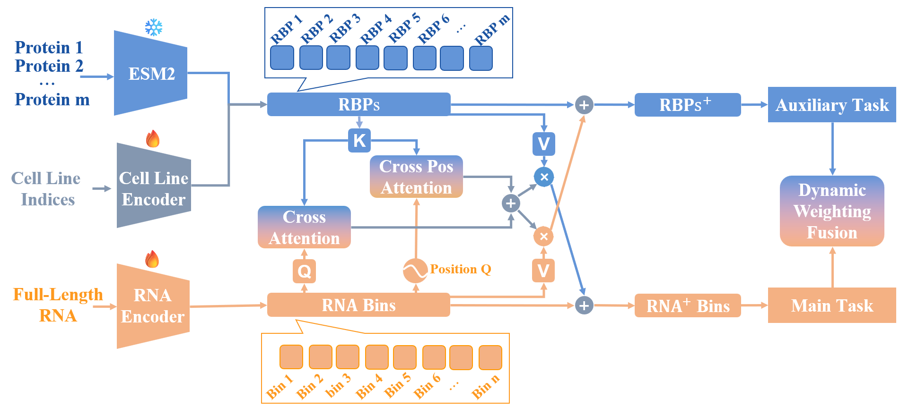

# RBP-XFormer

Predict RNA-protein Binding Sites on Full-length RNA Transcripts with Information of Multiple RBPs

## Authors

Yichong Li<sup>1</sup>, Gufeng Yu<sup>1</sup>, Xiaoyong Pan<sup>2,3</sup> and Yang Yang<sup>1,4,*</sup>

<sup>1</sup> Department of Computer Science and Engineering, Shanghai Jiao Tong University, Shanghai 200240, China  
<sup>2</sup> Institute of Image Processing and Pattern Recognition, Shanghai Jiao Tong University, Shanghai 200240, China  
<sup>3</sup> Key Laboratory of System Control and Information Processing, Ministry of Education of China, Shanghai, 200240, China  
<sup>4</sup> Key Laboratory of Shanghai Education Commission for Intelligent Interaction and Cognitive Engineering, Shanghai, 200240, China  

*Corresponding Author: yangyang@cs.sjtu.edu.cn

## Overview

RBP-XFormer is a multimodal deep learning framework for predicting the binding of multiple RBPs to RNA fragments (bins) in full-length RNA transcripts. It comprises three encoders, cross-attention layers, and main and auxiliary task output layers. The encoders capture features from protein sequences, cell lines, and full-length RNA transcripts. Protein and cell-line features are concatenated to represent RBPs in different cell lines. Cross-attention mechanisms then integrate RNA and RBP features by computing multi-head attention between RBP and RNA representations and RNA's positional encoding. The combined attention matrices yield refined RNA and RBP representations. These are fed into the main and auxiliary task output layers to produce predictions and compute losses. Dynamic weighting adjusts the loss balance between the two tasks. During training, the protein encoder is frozen, while other components are trained.



## Features

- **Multimodal Architecture**: Three specialized encoders for processing protein sequences, cell lines, and full-length RNA transcripts
- **Advanced Cross-Attention**: Multi-head attention mechanism integrating RNA and RBP features with positional encoding
- **Cell Line Specificity**: Incorporates cell line information to model RBP binding in different cellular contexts
- **Multi-Task Learning**: Combines main and auxiliary tasks with dynamic loss weighting
- **Efficient Training**: Frozen protein encoder with trainable RNA and cell line components
- **Comprehensive Prediction**: Supports prediction for 166 RNA-binding proteins
- **ESM Integration**: Leverages ESM protein embeddings for enhanced protein representation

## Requirements

The project requires Python 3.x and the following packages:

```bash
# Core dependencies
torch>=1.8.0        # PyTorch for deep learning
numpy>=1.19.2       # Numerical computing
biopython>=1.79     # Biological sequence processing
scikit-learn>=0.24.2 # Machine learning utilities
tqdm>=4.62.3        # Progress bars
wandb>=0.12.0       # Experiment tracking (optional)
psutil>=5.8.0       # System and process utilities
enformer-pytorch>=0.0.1  # Transformer architecture
```

You can install all dependencies using:
```bash
pip install -r requirements.txt
```

## Installation

1. Clone the repository:
```bash
git clone [repository-url]
cd RBP_XFormer
```

2. Install the required packages:
```bash
pip install -r requirements.txt
```

## Project Structure

```
RBP-XFormer/
├── data/                  # Data directory
│   ├── rbp_list.pkl      # List of RBPs
│   └── p_dict_320.pkl    # Protein dictionary
├── model/                 # Model implementation
│   ├── rbp_xformer.py    # Main RBP-XFormer model
│   ├── enformer_rbp.py   # Enformer-based RBP model
│   └── __init__.py       # Package initialization
├── utils/                 # Utility functions
│   ├── config_rbp.json   # Model configuration
│   ├── data.py           # Data processing utilities
│   └── loss.py           # Loss functions
├── example/              # Example files
│   └── rna_seq.fasta     # Example RNA sequences
├── parameters/           # Model parameters
├── results/             # Output directory
├── img/                 # Images and figures
│   └── framework_p.png  # Model framework diagram
├── train.py             # Training script
├── infer.py             # Inference script
├── requirements.txt     # Project dependencies
└── README.md           # Project documentation
```

## Usage

### Inference

To run inference on RNA sequences:

```bash
python infer.py \
    --batch_size 8 \
    --device_id 0 \
    --model_dir ./params/rbp_xformer.pt \
    --out_root ./results/ \
    --rna_dir ./example/rna_seq.fasta
```

Parameters:
- `--batch_size`: Batch size for inference (default: 8)
- `--device_id`: GPU device ID (default: 0)
- `--model_dir`: Path to the model checkpoint
- `--out_root`: Output directory for results
- `--rna_dir`: Path to input RNA sequences in FASTA format

### Input Format

The input RNA sequences should be in FASTA format. Example:
```
>sequence1
ATCGATCGATCG
>sequence2
GCTAGCTAGCTA
```

### Output

The model generates predictions for each input RNA sequence and saves them as pickle files in the specified output directory. Each output file contains a tensor with the following characteristics:

- Shape: `[num_fragments, num_rbps]`
  - `num_fragments`: Number of 128nt-length fragments in the full-length RNA transcript
  - `num_rbps`: Number of RBPs (166)
- Content: Each element represents the binding probability between a specific RNA fragment and a specific RBP
- RBP Order: The order of RBPs in the tensor corresponds to the order in `./data/rbp_list.pkl`

Example output structure:
```
results/
├── sequence1.pkl  # Tensor of shape [fragments1, 166]
├── sequence2.pkl  # Tensor of shape [fragments2, 166]
└── ...
```

You can load and process the output using:
```python
import pickle
import torch

# Load predictions for a sequence
with open('results/sequence1.pkl', 'rb') as f:
    predictions = pickle.load(f)
    
# predictions shape: [num_fragments, 166]
# predictions[i, j] represents the binding probability 
# between fragment i and RBP j
```

## Model Architecture

The model uses a transformer-based architecture with the following key components:
- Multi-head attention mechanism
- ESM protein embeddings integration
- Cell line-specific features
- Cross-attention between RNA and protein features

